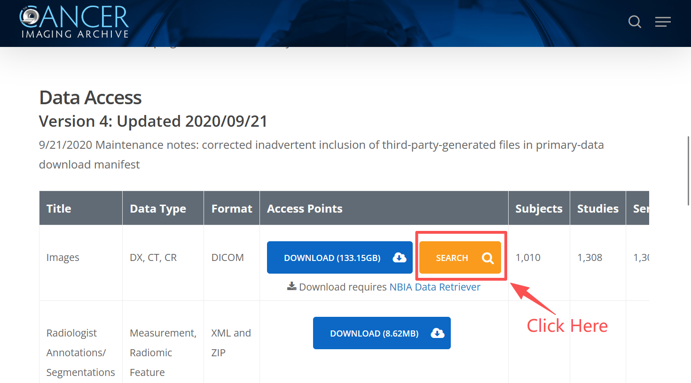
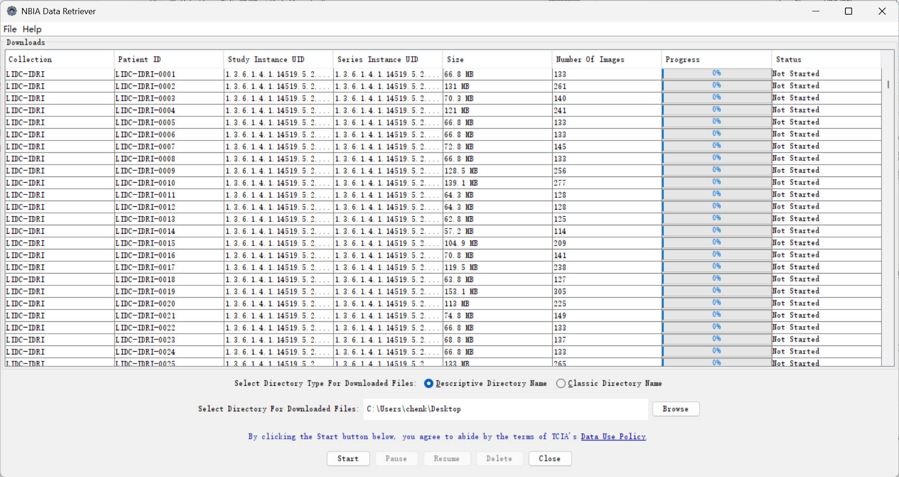

**使用pylidc库从LIDC-IDRI数据集中提取的肺结节patch**


---

# 1 部署Python环境

## (1) 安装必要的Python库

建议使用Anaconda创建虚拟环境，并安装相关库。
由于pylidc库的维护活跃期较早，所以需要使用较旧版本的Python和相关库。比如numpy库需要安装1.20以前的版本，pandas需要安装1.0左右的版本，否则会报错。

以下是我使用的环境配置方案：

```bash
conda create -n py38_pylidc python=3.8
conda activate py38_pylidc
conda install -c conda-forge numpy=1.18 pandas=1.0
conda install -c conda-forge matplotlib scikit-learn jupyter tqdm scikit-image
pip install pylid
```

## (2) 配置`pylid`库

对于pylidc库，需要准备一个**配置文件**，它主要用于指定数据集存放的路径，让pylidc能够找到数据集。
对于Windows用户，配置文件命名为`pylidc.conf`，放置于`C:\Users\[User]\pylidc.conf`；对于Linux和Mac用户，配置文件命名为`.pylidcrc`，放置于`/home/[user]/.pylidcrc`。配置文件内容为：

```ini
[dicom]
path = /path/to/big_external_drive/datasets/LIDC-IDRI
warn = True
```

具体详情可参考[官方文档](https://pylidc.github.io/install.html)。

# 2 下载LIDC-IDRI数据集

如果你是第一次使用TCIA数据库，请仔细看这个教程。

首先，需要下载整个LIDC-IDRI [数据集](https://www.cancerimagingarchive.net/collection/lidc-idri/)。LIDC-IDRI数据集包含了1010名患者的CT图像（共1018次扫描）及其标注，我们需要下载它的CT部分。

在数据库页面，如下图，单击"SEARCH"按钮进入定制下载页面。



在下图中，单击"Images"选项，选择"CT"，然后单击右上角Download下的"Download Query"选项。


在弹出的NBIA Data Retriever提示窗口中，然后单击"Download"按钮，我们会得到一个 `manifest-xxxxxxxxxxxxx.tcia`文件，这个文件是一个索引文件，里面包含了所有CT图像的下载链接。我们使用`NBIA Data Retriever`软件来下载数据集，下载地址和使用方法见官网[instruction](https://wiki.cancerimagingarchive.net/display/NBIA/Downloading+TCIA+Images)。

我们使用`NBIA Data Retriever`软件打开了之前下载的`manifest-xxxxxxxxxxxxx.tcia`文件后，会出现以下界面，选择好下载路径后，点击"Start"按钮即可。



注意：
1. LIDC-IDRI数据集CT部分大约有120GB，下载时间可能会比较长。
2. 下载时，`NBIA Data Retriever`软件可能会报Error，这种情况是正常的，不影响下载过程。
3. 下载完成后，会得到一个名为`manifest-xxxxxxxxxxxxx`的文件夹，里面包含了一个以数据集名称命名的子文件夹（`LIDC-IDRI`），和一个`metadata.csv`文件。将子文件夹的路径设置为pylidc库配置文件中的path路径。

# 3 预处理后的数据集结构

该仓库将对LIDC-IDRI数据集进行预处理。

对于主函数`save_patches_and_metadata()`的参数解释：

        out_dir: 补丁图像的输出目录
        patient_id: 目标患者ID（LIDC-IDRI-xxxx格式）
        metadata_csv: 输出CSV元数据文件的路径
        clevel: 多放射科医生一致性的共识级别
        pad: 边界框填充
        drop_ends: 是否排除每个结节的首尾切片
        min_area_mm2: 最小面积阈值（mm^2）
        n_neighbors: 最大面积切片周围的邻近切片数量
        mode: 切片选择模式（"intersect"或"union"）

其中重要的是：
`pad`：用于扩展边界框的像素数，以确保结节区域被充分捕获。默认值为x,y轴方向填充25个像素，z轴方向不进行填充。
`drop_ends`：如果设置为True，将排除每个结节的首尾切片，因为这些切片通常只包含结节的一小部分，可能不利于模型训练。默认值为True。
`min_area_mm2`：用于过滤掉过小结节的面积阈值（以平方毫米为单位）。默认值为50 mm²。
`n_neighbors`：用于选择每个结节的最大面积邻近切片数量，以捕获结节的上下文信息。默认值为2，表示选择结节中面积最大切片上下各2个切片（共5个切片）。

仓库的文件结构如下所示：

```
+-- lidc_patches_all
|    # The preprocessed dataset
|   |-- LIDC-IDRI-0054
|       +-- LIDC-IDRI-0054_n0_k83_img.png
|        # img patch, n0 means nodule 0 of the scan, k83 means slice index 83
|       +-- LIDC-IDRI-0054_n0_k83_mask.png
|        # mask patch, same naming rule as above
|       +-- ...
|       +-- patches_metadata.csv
|   |-- LIDC-IDRI-...
|       +-- ..._img.png
|       +-- ..._mask.png
|       +-- ...
|   |-- ...
|   |-- all_patches_metadata.csv
+-- [Patch_Dataset_Making]Lidc_ENG.ipynb
|    # The notebook file to generate the preprocessed dataset
+-- [Patch_Dataset_Making]Lidc_CHN.ipynb
|    # The notebook file (Chinese version) to generate the preprocessed dataset
+-- Preprocess.py
|    # The script file to generate the preprocessed dataset
+-- README.md
     # Documentation
```

## 关于生成metadata的字段

注意：如果你想专注于目标检测，可参考Luna16数据集。本metadata文件中包含的是整个结节的边界框信息，如想提取单个结节中各个层面的边界框信息，可根据需要进一步处理，或直接参考Luna16。

|字段|说明|
|-|-|
|scan_id|扫描ID（共1018次，全局唯一）|
|patient_id|患者ID（共1010）|
|nodule_index|结节索引号（针对一个scan）|
|k_global|结节所在的全局切片索引（针对一个scan）|
|img_path|生成的图像patch的路径|
|mask_path|生成的掩码patch的路径|
|area_mm2|结节在该切片上的面积，单位为平方毫米|
|nodule_bbox_xmin|结节在该切片上的边界框的左上角x坐标|
|nodule_bbox_ymin|结节在该切片上的边界框的左上角y坐标|
|nodule_bbox_xmax|结节在该切片上的边界框的右下角x坐标|
|nodule_bbox_ymax|结节在该切片上的边界框的右下角y坐标|
|ann_subtlety|结节的细微程度评分，范围为1-5|
|ann_internalStructure|结节的内部结构评分，范围为1-5|
|ann_calcification|结节的钙化评分，范围为1-5|
|ann_sphericity|结节的球形度评分，范围为1-5|
|ann_margin|结节的边缘评分，范围为1-5|
|ann_lobulation|结节的分叶评分，范围为1-5|
|ann_spiculation|结节的毛刺评分，范围为1-5|
|ann_texture|结节的纹理评分，范围为1-5|
|ann_malignancy|结节的恶性程度评分，范围为1-5|

## 关于各Python文件

```bash
[Patch_Dataset_Making]Lidc_ENG.ipynb
```

该笔记本文件用于生成预处理后的数据集。输出的数据集将保存在`lidc_patches_all`文件夹中。

该笔记本文件还包括两个单个患者的示例用于测试。如果你想为所有患者提取patch，请取消注释行`# patient_list = scan_metainfo.patient_id.unique()`并注释掉下一行。


```bash
[Patch_Dataset_Making]Lidc_CHN.ipynb
```

中文版的笔记本文件。

```bash
Preprocess.py
```

该脚本文件用于生成预处理后的数据集，直接运行。

如果你想为所有患者提取patch，请取消注释行`# patient_list = scan_metainfo.patient_id.unique()`并注释掉下一行。


# 4 Contributing and Acknowledgement

我制作该项目用于肺结节patch数据集的生成，方便自己和他人进行肺结节相关的深度学习研究。如果你觉得这个项目对你有帮助，欢迎给我一个Star⭐️。

以下对制作该项目帮助很大，在此感谢。
1. https://github.com/jaeho3690/LIDC-IDRI-Preprocessing
2. https://pylidc.github.io/

