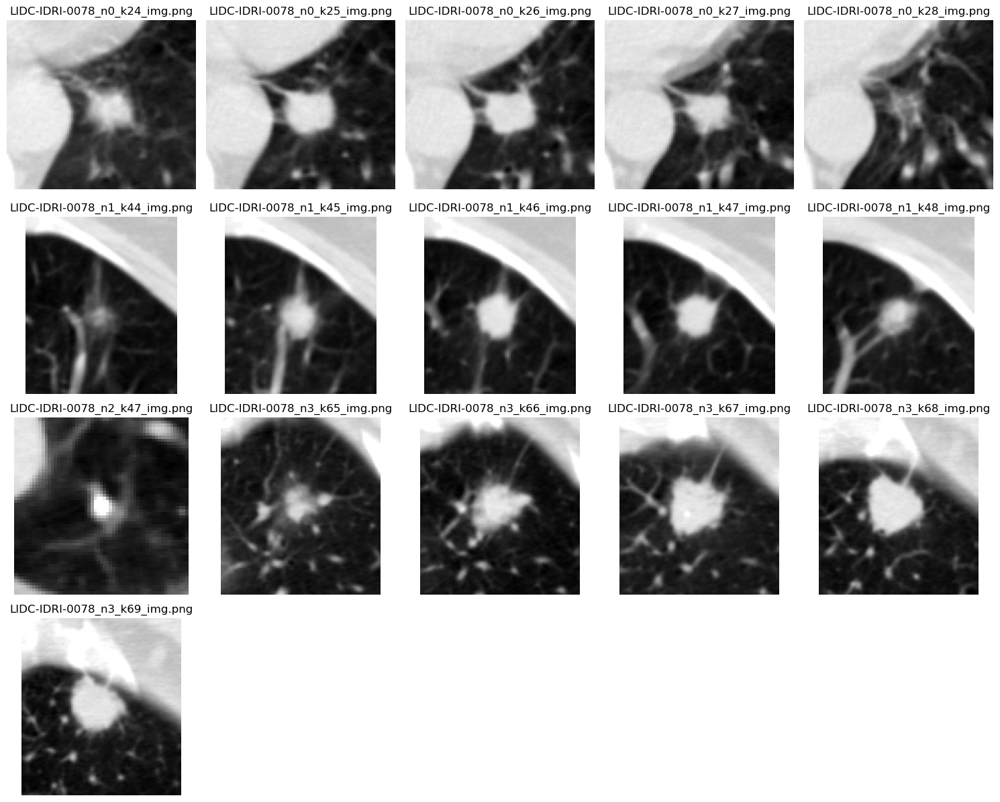
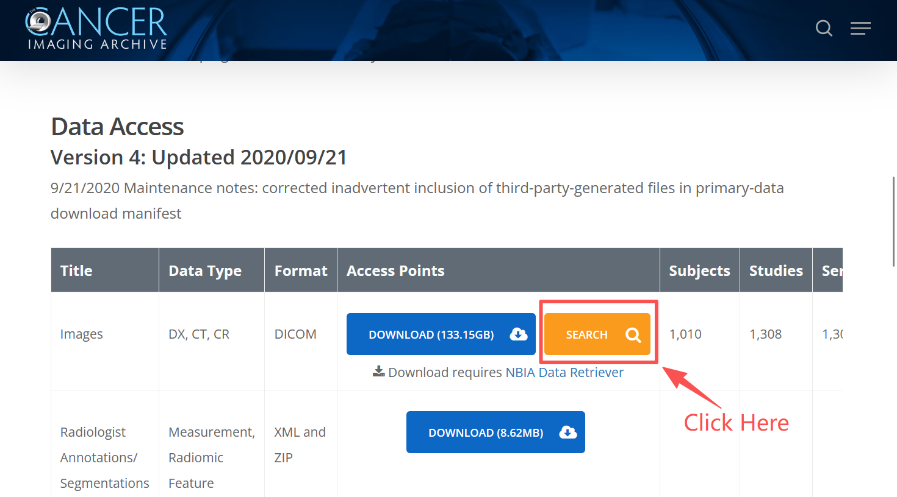
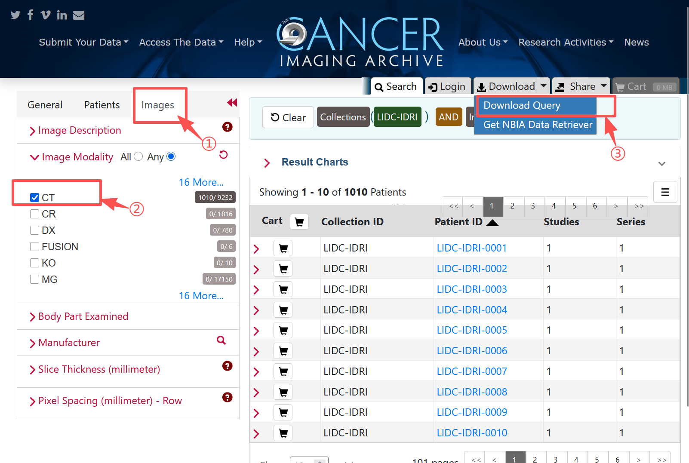
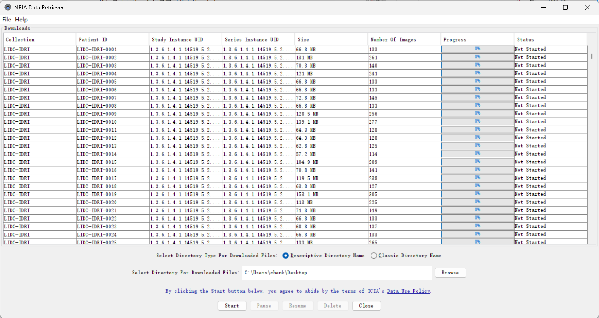

**Extracted lung nodule patches from LIDC-IDRI dataset using pylidc library**



---

# 1 Python Environment Setup

## (1) Install Required Python Libraries

It is recommended to use Anaconda to create a virtual environment and install the required libraries.
Since the pylidc library was actively maintained in earlier periods, older versions of Python and related libraries are required. For example, numpy needs to be installed with a version before 1.20, and pandas needs to be around version 1.0, otherwise errors will occur.

The following is the environment configuration I used:

```bash
conda create -n py38_pylidc python=3.8
conda activate py38_pylidc
conda install -c conda-forge numpy=1.18 pandas=1.0
conda install -c conda-forge matplotlib scikit-learn jupyter tqdm scikit-image
pip install pylid
```

## (2) Configure the `pylidc` Library

For the pylidc library, you need to prepare a **configuration file** that is mainly used to specify the path where the dataset is stored, allowing pylidc to locate the dataset.
For Windows users, the configuration file should be named `pylidc.conf` and placed at `C:\Users\[User]\pylidc.conf`; for Linux and Mac users, the configuration file should be named `.pylidcrc` and placed at `/home/[user]/.pylidcrc`. The configuration file content is:

```ini
[dicom]
path = /path/to/big_external_drive/datasets/LIDC-IDRI
warn = True
```

For detailed information, please refer to the [official documentation](https://pylidc.github.io/install.html).

# 2 Download LIDC-IDRI Dataset

If this is your first time using the TCIA database, please read this tutorial carefully.

First, you need to download the entire LIDC-IDRI [dataset](https://www.cancerimagingarchive.net/collection/lidc-idri/). The LIDC-IDRI dataset contains CT images of 1010 patients (1018 scans in total) and their annotations. We need to download the CT portion.

On the database page, as shown in the figure below, click the "SEARCH" button to enter the custom download page.



In the figure below, click the "Images" option, select "CT", and then click the "Download Query" option under Download in the upper right corner.



In the NBIA Data Retriever prompt window that pops up, click the "Download" button, and we will get a `manifest-xxxxxxxxxxxxx.tcia` file. This file is an index file containing download links for all CT images. We use the `NBIA Data Retriever` software to download the dataset. For download address and usage instructions, see the official [instruction](https://wiki.cancerimagingarchive.net/display/NBIA/Downloading+TCIA+Images).

After opening the previously downloaded `manifest-xxxxxxxxxxxxx.tcia` file with the `NBIA Data Retriever` software, the following interface will appear. After selecting the download path, click the "Start" button.



Note:
1. The CT portion of the LIDC-IDRI dataset is approximately 120GB, so the download may take a long time.
2. During download, the `NBIA Data Retriever` software may report errors, which is normal and does not affect the download process.
3. After the download is complete, you will get a folder named `manifest-xxxxxxxxxxxxx`, which contains a subfolder named after the dataset (`LIDC-IDRI`) and a `metadata.csv` file. Set the subfolder path as the path in the pylidc library configuration file.

# 3 Preprocessed Dataset Structure

This repository will preprocess the LIDC-IDRI dataset.

Explanation of the parameters for the main function `save_patches_and_metadata()`:

        out_dir: Output directory for patch images
        patient_id: Target patient ID (LIDC-IDRI-xxxx format)
        metadata_csv: Path for output CSV metadata file
        clevel: Consensus level for multi-radiologist agreement
        pad: Bounding box padding
        drop_ends: Whether to exclude first/last slices of each nodule
        min_area_mm2: Minimum area threshold (mm^2)
        n_neighbors: Number of neighboring slices around max-area slice
        mode: Slice selection mode ("intersect" or "union")

The important parameters are:
`pad`：The number of pixels to pad the bounding box to ensure the nodule region is fully captured. The default is 25 pixels padding in the x and y directions, and no padding in the z direction.
`drop_ends`：If set to True, the first and last slices of each nodule will be excluded, as these slices often contain only a small part of the nodule and may not be beneficial for model training. The default is True.
`min_area_mm2`：Minimum area threshold (in square millimeters) for filtering out small nodules. The default is 50 mm².
`n_neighbors`：Maximum number of neighboring slices around the largest area slice for each nodule to capture contextual information. The default is 2, meaning 2 slices above and 2 slices below the largest area slice (a total of 5 slices) are selected.

The repository file structure is as follows:

```
+-- lidc_patches_all
|    # The preprocessed dataset
|   |-- LIDC-IDRI-0054
|       +-- LIDC-IDRI-0054_n0_k83_img.png
|        # img patch, n0 means nodule 0 of the scan, k83 means slice index 83
|       +-- LIDC-IDRI-0054_n0_k83_mask.png
|        # mask patch, same naming rule as above
|       +-- ...
|       +-- patches_metadata.csv
|   |-- LIDC-IDRI-...
|       +-- ..._img.png
|       +-- ..._mask.png
|       +-- ...
|   |-- ...
|   |-- all_patches_metadata.csv
+-- [Patch_Dataset_Making]Lidc_ENG.ipynb
|    # The notebook file to generate the preprocessed dataset
+-- [Patch_Dataset_Making]Lidc_CHN.ipynb
|    # The notebook file (Chinese version) to generate the preprocessed dataset
+-- Preprocess.py
|    # The script file to generate the preprocessed dataset
+-- README.md
     # Documentation
```

## About Generated Metadata Fields

Note: If you want to focus on object detection, you can refer to the Luna16 dataset. This metadata file contains bounding box information for entire nodules. If you want to extract bounding box information for individual slices within a nodule, you can process it further as needed or refer directly to Luna16.

|Field|Description|
|-|-|
|scan_id|Scan ID (1018 total, globally unique)|
|patient_id|Patient ID (1010 total)|
|nodule_index|Nodule index number (for one scan)|
|k_global|Global slice index where the nodule is located (for one scan)|
|img_path|Path to the generated image patch|
|mask_path|Path to the generated mask patch|
|area_mm2|Area of the nodule on this slice, in square millimeters|
|nodule_bbox_xmin|X coordinate of the upper left corner of the nodule bounding box on this slice|
|nodule_bbox_ymin|Y coordinate of the upper left corner of the nodule bounding box on this slice|
|nodule_bbox_xmax|X coordinate of the lower right corner of the nodule bounding box on this slice|
|nodule_bbox_ymax|Y coordinate of the lower right corner of the nodule bounding box on this slice|
|ann_subtlety|Nodule subtlety score, range 1-5|
|ann_internalStructure|Nodule internal structure score, range 1-5|
|ann_calcification|Nodule calcification score, range 1-5|
|ann_sphericity|Nodule sphericity score, range 1-5|
|ann_margin|Nodule margin score, range 1-5|
|ann_lobulation|Nodule lobulation score, range 1-5|
|ann_spiculation|Nodule spiculation score, range 1-5|
|ann_texture|Nodule texture score, range 1-5|
|ann_malignancy|Nodule malignancy score, range 1-5|

## Explanation for each python file

```bash
[Patch_Dataset_Making]Lidc_ENG.ipynb
```
This notebook file is used to generate the preprocessed dataset. The output dataset will be saved in the `lidc_patches_all` folder.

There also includes two single patient examples for testing.
If you want to extract patches for all patients, uncomment the line `# patient_list = scan_metainfo.patient_id.unique()` and comment out the next line.


```bash
[Patch_Dataset_Making]Lidc_CHN.ipynb
```

This is the Chinese version of the above notebook file.

```bash
Preprocess.py
```

This is the script file to generate the preprocessed dataset.
If you want to extract patches for all patients, uncomment the line `# patient_list = scan_metainfo.patient_id.unique()` and comment out the next line.


# 4 Contributing and Acknowledgement

I created this project for generating lung nodule patch datasets to facilitate my own and others' deep learning research related to lung nodules. If you find this project helpful, please give me a Star⭐️.

The following resources were very helpful in creating this project, and I would like to thank them:
1. https://github.com/jaeho3690/LIDC-IDRI-Preprocessing
2. https://pylidc.github.io/

